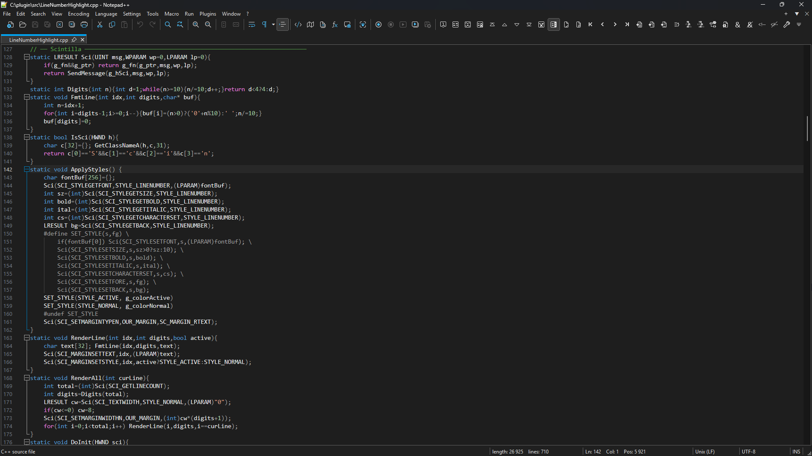
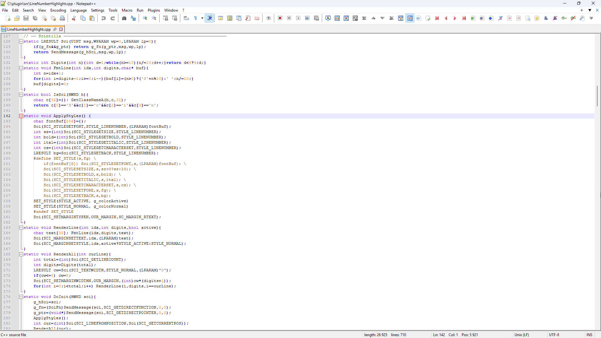
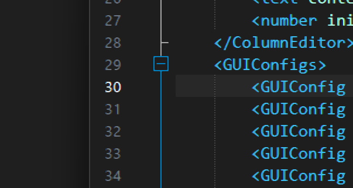

# Line Number Highlight

A Notepad++ plugin that replicates the line number behavior from **VS Code**: the active line number is shown in a bright color, all others are dimmed. Lightweight, zero-config, works automatically with both dark and light Notepad++ themes.

## Preview






---

## Preview

| Dark theme                                   | Light theme                                  |
| -------------------------------------------- | -------------------------------------------- |
| Active line: `#CCCCCC` · Inactive: `#6E7681` | Active line: `#1A1A1A` · Inactive: `#999999` |

---

## Features

- Highlights the **active line number** in a distinct color
- Dims all **inactive line numbers** automatically
- Adapts to Notepad++ **dark and light themes** without any manual switching
- Separate color settings are remembered for each theme independently
- Fully customizable via a themed Settings dialog

---

## Installation

1. Download `LineNumberHighlight.dll` from the [Releases](../../releases) page
2. Create the folder:
   
   ```
   C:\Program Files\Notepad++\plugins\LineNumberHighlight\
   ```
3. Copy `LineNumberHighlight.dll` into that folder
4. Restart Notepad++
5. The plugin will appear under **Plugins → Line Number Highlight**

---

## Settings

Open via **Plugins → Line Number Highlight → Settings**

| Option                | Description                                      |
| --------------------- | ------------------------------------------------ |
| Active line number    | Color used for the current line number           |
| Inactive line numbers | Color used for all other line numbers            |
| Pick color            | Opens the system color picker                    |
| Reset                 | Restores the default color for the current theme |

Settings are saved per-theme to:

```
%APPDATA%\Notepad++\plugins\Config\LineNumberHighlight.ini
```

---

## Requirements

- **Notepad++** v8.0 or later (tested on v8.9.2)
- **Windows 10 / 11** x64 (tested on Windows 11)
- No additional runtimes or dependencies required

---

## Performance

The plugin uses Scintilla's `SCN_UPDATEUI` notification with direct function calls — no timers, no background threads, no polling. CPU impact is negligible even on large files.

---

## Building from source

Written in **C++**, compiled with MinGW (winlibs x86\_64-15.2.0, msvcrt).

```bat
x86_64-w64-mingw32-g++ -std=c++14 -O2 -DUNICODE -D_UNICODE ^
  -shared -static-libgcc -static-libstdc++ -Wl,--kill-at ^
  -o LineNumberHighlight.dll src/LineNumberHighlight.cpp src/exports.def ^
  -lkernel32 -luser32 -lcomdlg32 -lgdi32 -ladvapi32
```

No external libraries or build systems required.

---

## License

Free to use, free to modify. Provided **as-is** with no warranty or support of any kind.

© VitalS 2026
